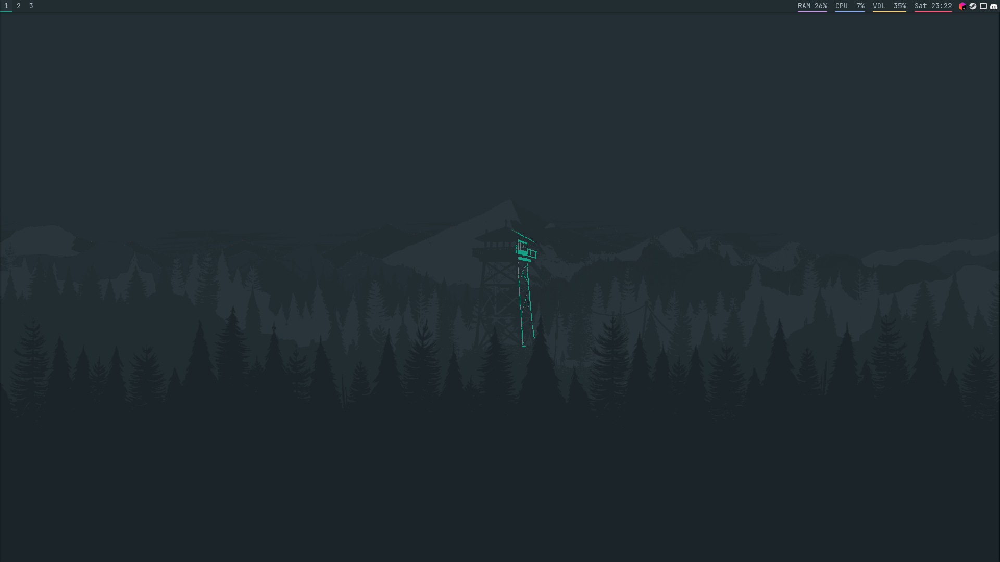
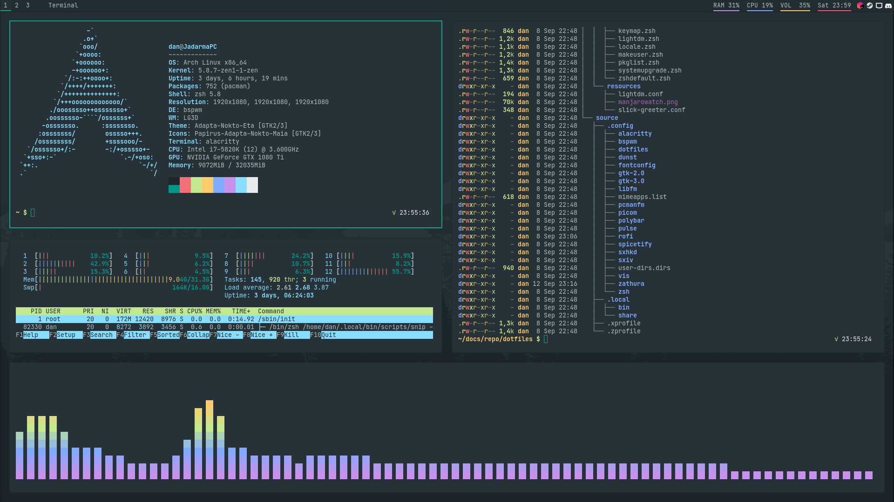

# Dotfiles

**Read the full documentation at [jadarma.github.io/dotfiles](https://jadarma.github.io/dotfiles)!**

## Contents

There are three main directories:

📖 **Documentation** - The `docs` directory contains markdown sources for the documentation.\
🛠️ **Setup** - The `setup` directory contains scripts that automate the installation process.\
📃 **Dotfiles** - The `source` directory contains all the dotfiles.

## Preview

