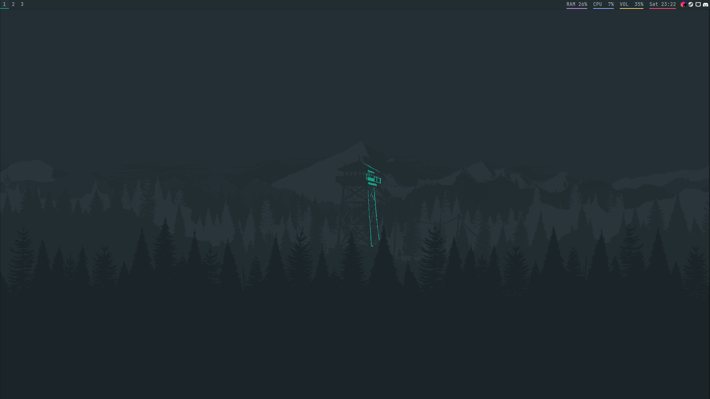
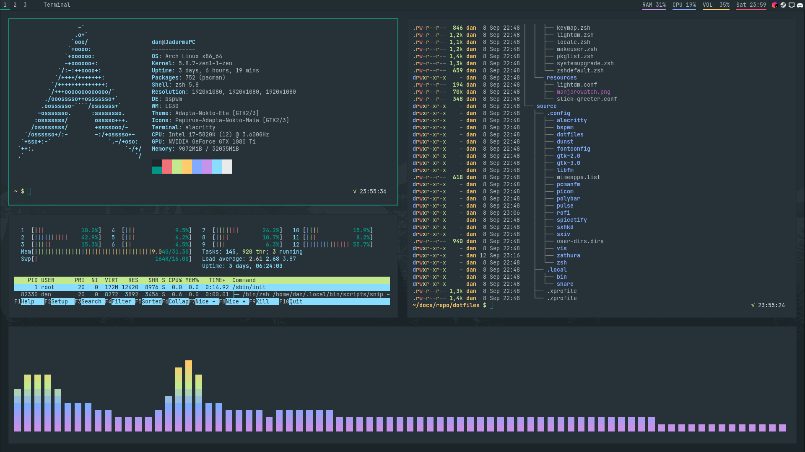

# Jadarma's Dotfiles

Welcome! This is the documentation for my dotfiles repo.

### Getting Started

The preferred method of installation is to do a fresh install of Arch, then run the automated setup script.
Please follow the [Installation Guide](/install/00_GettingStarted) for details.

If, however, you wish to copy specific configurations only, all dotfiles are available in the `source` directory.
Keep in mind that some configurations depend on other programs as well.

After installation, you will be thrown into the graphical environment without much information.
Most things are keyboard-driven.
To learn how to use my setup, what features are available, and how to tweak the configurations to suit your tastes,
please read the [Usage Guide](/features/UsageGuide) section.

### Screenshots

!!! warning
    The dotfile repo is still in "early" development stage.
    While providing _mostly_ a usable system out of the box, some functionality might still be missing, as this setup is
    transitioning from being on top of an existing Manjaro installation to its standalone Arch install.
